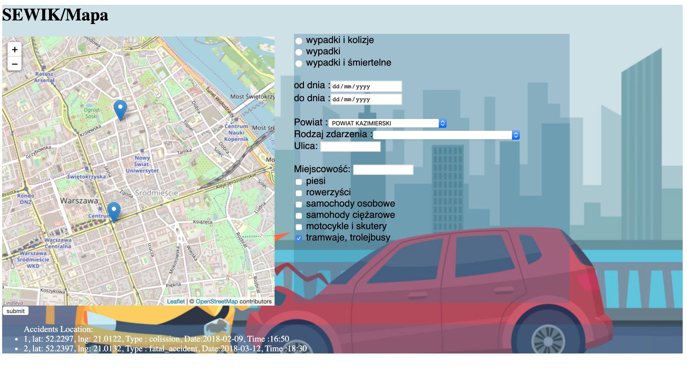
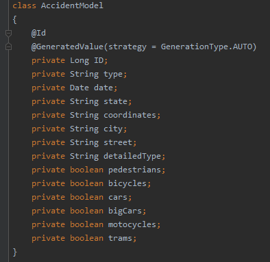

# Problem Description

Accidents are sadly an everyday occurrence, new laws and regulations are constantly added in an attempt of making roads safer. However, no matter how many laws are put into place, accidents still happen. Another way of combatting accidents is analyzing them, figuring out all the factors that contributed to the accidents. In Poland there is a publicly available database of accidents shared by the Police. Yet the way it is presented isn't useful or even readable for neither an average user nor a researcher thus it's potential isn't fully utilized.

# Problem Solution

A web application that visualizes the accidents on a map. The user can select the type of accident, time interval, region, etc. This will help utilize the Police database, thus possibly improving road safety because it will greatly speed up the process of analyzing accidents. Help determine the most dangerous intersections and the reasons behind it. Furthermore, this will be a great tool for the cities, people can easily spot the worst intersections and take action. 

We prepared such an application which displays info about traffic accidents. We store all the information about the accidents in a database and share it in our application.

That's how our web application looks from the user's perspective. You can filter the results by using filtering options on the right hand side. All the accidents which fulfill the conditions will show up on the map.

### Why is our project useful?

There are two reasons why such a tool is important.
* If a certain intersection on a road is dangerous and not well-planned many accidents happen there. Using our tool it's easy to see which spots or intersections should be rebuild to make roads safe.
* The information about the accident can be added in real time. It may be helpful for drivers who can change their route and not waste their time in traffic jams.

# Application Architecture

Our tool is a full-stack web application. Backend is based on java  spring ( gradle  project ).We have a web server which is connected to a PostgreSQL database. The databes stores information about single accidents. Here you can see which type of information is stored:

The web server runs in Docker as a container. Thanks to that it is a cross platform application and will work on every computer after proper configuration of the Docker. It does not need Java to be installed an a machine and neither does PostgreSQL database. Apart from that Spring framework has been used and the code is written in Java. Gradle build-automation system has been used too.

The frontend part is made in ReactJS. It uses Leaflet to display the map. We had problem  with printing informstion on the  popups so we decided to print accident related details below   the map as a solution with corresponding markers. 

The client sends a request to the server to fetch the data about the accidents. Then the server sends all the data back in as a .json file. The filtering of the results is done on the frontend side. This feature is not working yet though.

# Manual

### How to build the application and run it

Thanks to Docker it is easy to build the app.

#### run backend & frontend

 - `install docker`
 - `docker-compose up --build`
 
#### run only backend

 - `cd backend`
 - `./gradlew bootRun`

### Production build for frontend 
To  deploy  Frontend on netfily 
Run the command npm run build to create the production files.
The files are created in the build/ folder.

### How to use it

The web application is very easy to use and shouldn't pose any difficulties to even the newest internet users.
When a user opens the website the see a map on the left and search options to the right. That's where the user should initially focus their attention to and do the following:
1. Select which type of accidents should be displayed. (Radiobox)
2. Select the time period of interest.
3. Select the Region (powiat).
4. Options "Rodzaj zdarzenia", "Ulica", and "Miejscowość" can be selected but aren't necessary.
5. Select parties of interest involved in the accidents
6. Press "Wyświetl"

# Unit Tests

We prepared unit tests to check if the backend works correctly.
The code can be found in AccidentControllerTest.java
