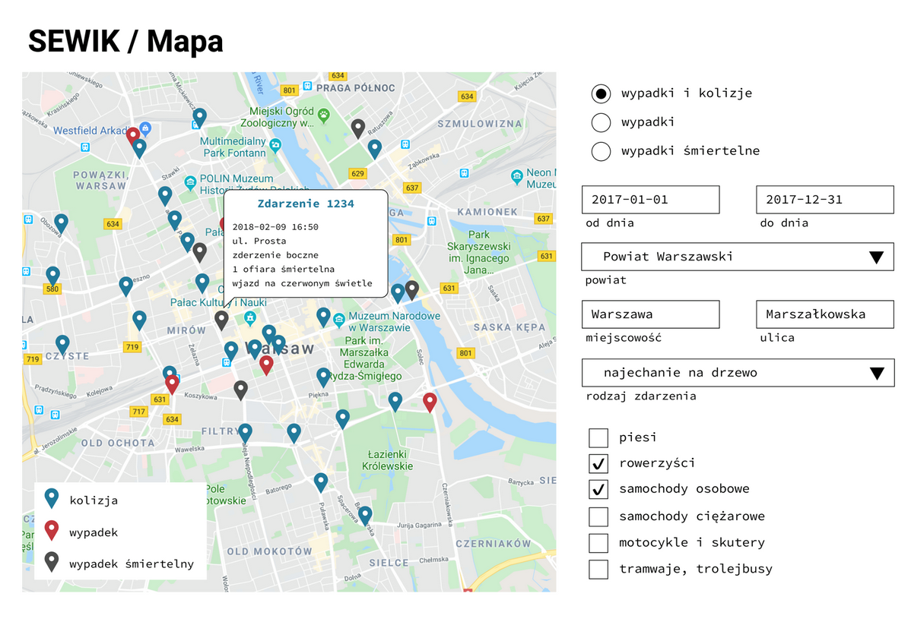

# What is our project about?

We prepared a web application which displays info about traffic accidents. We store all the information about the accidents in a database and share it in our application.

That's how our web application looks from the user's perspective. You can filter the results by using filtering options on the right hand side. All the accidents which fulfill the conditions will show up on the map.

There are 3 categories: colissions, accidents and fatal accidents. User can filter results using these categories, dates, location, type of accidents and kinds of vehicles participating in the accident.

# Why is our project useful?

There are two reasons why such a tool is important.
* If a certain intersection on a road is dangerous and not well-planned many accidents happen there. Using our tool it's easy to see which spots or intersections should be rebuild to make roads safe.
* The information about the accident can be added in real time. It may be helpful for drivers who can change their route and not waste their time in traffic jams.

